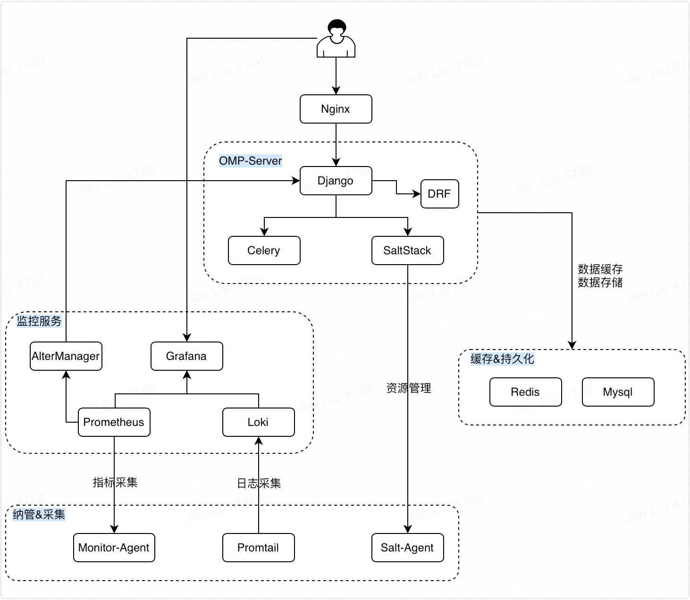

# OMP 运维管理平台

OMP（Operation Management Platform）是云智慧公司自主设计、研发，为用户提供便捷运维能力和业务管理的轻量级、聚合型、智能运维管理平台。

## 设计初衷

运维管理平台(OMP)的设计初衷是想打造一应俱全的运维平台，降低交付难度，提升运维自动化、智能化，提高运维效率，提升业务连续性和安全性。

## 运维痛点

- 主机环境多样性，难以统一管理，比如：混合云、私有云、跨IDC、虚拟化、容器化等
- 业务变更难度较大，自动编排能力较低
- 业务状态监控，多平台难以数据联动
- 业务出现异常，难以实现故障自愈
- 业务运行状态，难以评估，更难以分析
- 运维知识匮乏，缺少专家指导及专家解决方案

## 核心功能

- **主机纳管**：纳管主机资源，实时监控主机运行状态，可在线管理、在线连接终端等
- **应用管理**：平台已内置常用基础组件，也支持符合标准的自研服务发布到应用商店，从而提供便捷的应用管理，如：安装部署、变更发布、弹性扩缩容、在线配置、优化等
- **应用监控**：涵盖标准监控、定制监控、链路监控、智能监控等多种业务场景，通过大数据智能测算，可感知未来趋势，将异常控制在发生前
- **故障自愈**：当业务系统出现异常或故障时，可按照预定的自愈策略进行故障治理，极大降低故障对业务影响，减少企业损失
- **状态巡检**：自动、手动进行业务指标、运行状态汇总，支持自动发送报告到指定邮箱
- **备份/恢复**：针对核心数据进行本地+异地备份，支持自动执行备份并将数据发送至指定邮箱，达到异地的存储效果，确保数据安全
- **精简工具**：提供运维常用工具、命令、脚本、SQL等，为日常运维操作提供便利，减少误操作、减低技术门槛，支持自行维护、扩充更多工具
- **知识文库**：积累运维常用知识、技术、架构、解决方案等，支持自行维护、扩充文库内容
- **小智解答**：可以快速检索知识文库内容，如文库知识不足，可以申请人工远程支持
- **权限管理**：针对不同用户、角色，进行权限控制，及操作审计
- **大屏展示**：用大屏来展示最核心的运营状态
- [ ] **批量处理、流水线**：<待定>

## 架构设计



## 环境依赖

后端技术栈：
- Python 3.8.7
- Django 3.1.4
- Saltstack 3002.2
- Uwsgi 2.0.19.1

前端技术栈：
- Tengine 2.3.2
- React 17.0.1

监控技术栈：
- Prometheus 2.25.1
- Alertmanager 0.21.0
- Grafana  7.4.3
- Loki 2.1.0
- Promtail 2.2.0

## 安装部署

### CentOS 环境部署

OMP 安装包内部包含了其使用的绝大部分组件，但是缺少 `MySQL` 和 `Redis`，当前版本需要用户自行配置使用，建议将 OMP 部署在 `/data/` 下，当前版本部署流程如下：

- step0：克隆项目

```shell
$ git clone https://github.com/CloudWise-OpenSource/OMP.git
$ cd OMP
```

- step1：依赖环境配置

编辑文件 `vim config/omp.yaml`

*当前版本需要自行安装 `MySQL` 及 `Redis` 环境，安装方式请自行解决，配置信息如下：*

```yaml
# redis相关配置
redis:
  host: 127.0.0.1
  port: 6379
  password: <Redis密码>
# mysql相关配置
mysql:
  host: 127.0.0.1
  port: 3306
  username: <MySQL账户名称>
  password: <MySQL账户密码>
```

在安装配置完成 `MySQL` 后，需要登录 `MySQL` 客户端创建初始化数据库，命令如下：*

```shell
create database omp default charset utf8 collate utf8_general_ci;
grant all privileges on `omp`.* to 'common'@'%' identified by 'Common@123' with grant option;
flush privileges;
```

- step2：执行安装脚本

```shell
$ bash scripts/install.sh <local-ip>
# 注意1：local_ip为当前主机的ip地址，如主机上存在多网卡多IP情况，需要根据业务需求自行判断使用哪个ip地址
# 注意2：当前执行操作的用户即为OMP中各个服务进程的运行用户，在以后的维护中，也应使用此用户进行操作
```

- step3：grafana 配置（执行 `install.sh` 报错时执行此步骤，后续会进行优化）

```shell
# 如果在安装过程中出现了grafana相关安装错误，需要确认grafana是否已经启动
# 在grafana启动的前提下执行其更新命令
$ python3 scripts/source/update_grafana.py <local-ip>
```

- step4：grafana 跳转面板初始化（在跳转 grafana 出错情况下使用）

```shell
$ python3 omp_server/manage.py shell
Python 3.8.7 (default, Dec 22 2020, 06:47:35)
[GCC 4.8.5 20150623 (Red Hat 4.8.5-44)] on linux
Type "help", "copyright", "credits" or "license" for more information.
(InteractiveConsole)
>>> from utils.plugin.synch_grafana import synch_grafana_info
>>> synch_grafana_info()
>>> quit()
```

### Web 访问

通过浏览器访问页面，访问入口为：http://omp.cloudwise.com
- 默认用户名：admin
- 默认密码：Common@123

*说明：每晚 00:00 将重置数据*

### 卸载 OMP

自行安装的 MySQL 和 Redis 可按需进行卸载操作, OMP 节点上卸载操作如下：

```shell
# 停止所有服务
$ bash scripts/omp all stop
```

### 脚本说明

OMP 的控制脚本位于 `scripts/omp` 其具体使用方式如下：

```shell
$ bash omp [all|tengine|uwsgi|worker|cron|salt|prometheus|alertmanager|grafana|loki] [status|start|stop|restart]
# OMP的所有组件的控制参数
$ bash omp all [status|start|stop|restart]
# 控制tengine的启停，影响页面访问
$ bash omp tengine [status|start|stop|restart]
# 控制django后端程序启停，影响页面访问
$ bash omp uwsgi [status|start|stop|restart]
# 控制celery异步任务启停，影响异步任务执行
$ bash omp worker [status|start|stop|restart]
# 控制celery定时任务，影响定时任务执行
$ bash omp cron [status|start|stop|restart]
# 控制salt-master的启停，影响服务端对Agent端的控制
$ bash omp salt [status|start|stop|restart]
# 控制prometheus的启停，影响页面监控数据
$ bash omp prometheus [status|start|stop|restart]
# 控制alertmanager的启停，影响告警邮件的发送，页面告警信息展示
$ bash omp alertmanager [status|start|stop|restart]
# 控制grafana的启停，影响页面grafana iframe数据、页面展示
$ bash omp grafana [status|start|stop|restart]
# 控制loki的启停，影响日志采集、页面展示服务日志问题
$ bash omp loki [status|start|stop|restart]
```

## 更新日志

[更新日志](./doc/changelogs.md)

## 欢迎加入

获取更多关于 OMP 的技术资料，或加入 OMP 开发者交流群，可扫描下方二维码咨询


